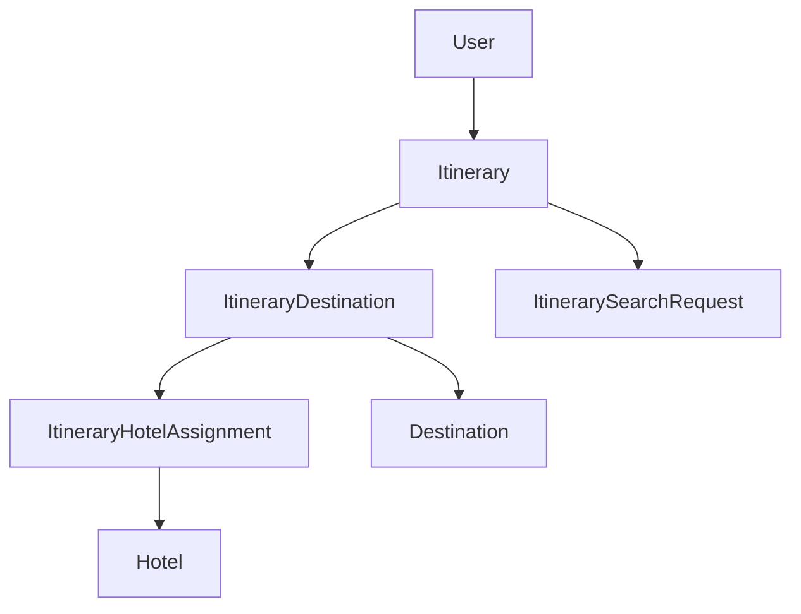

# Itinerary Optimization API Guide

A comprehensive guide for the multi-destination itinerary optimization system with flexible search modes and hotel cost minimization.

## 🌟 Overview

The Itinerary Optimization API provides intelligent trip planning with multiple search strategies, hotel cost optimization, and comprehensive caching. The system optimizes consecutive destination visits while minimizing accommodation costs through advanced algorithms.

### Key Features
- 🎯 **Multi-Mode Search**: Normal, ranges, fixed dates, and combined search
- 💰 **Cost Optimization**: Smart hotel selection with single-hotel preference
- ⚡ **High Performance**: Redis caching and efficient algorithms
- 🔄 **Flexible Destinations**: Support for up to 10 destinations per trip
- 🌍 **Multi-Currency**: Automatic currency conversion and pricing
- 📊 **Rich Analytics**: Comprehensive optimization metadata and statistics

---

## 🚀 Quick Start

### Basic Optimization Request
```bash
curl -X POST "http://localhost:8000/api/v1/itineraries/optimize" \
  -H "Authorization: Bearer YOUR_TOKEN" \
  -H "Content-Type: application/json" \
  -d '{
    "custom": false,
    "destinations": [
      {"destination_id": 101, "nights": 2},
      {"destination_id": 102, "nights": 3}
    ],
    "global_date_range": {
      "start": "2025-11-01",
      "end": "2025-11-30"
    },
    "guests": {"adults": 2},
    "currency": "USD"
  }'
```

### Advanced Multi-Mode Search
```bash
curl -X POST "http://localhost:8000/api/v1/itineraries/optimize" \
  -H "Authorization: Bearer YOUR_TOKEN" \
  -H "Content-Type: application/json" \
  -d '{
    "custom": true,
    "search_types": ["normal", "ranges"],
    "destinations": [
      {"destination_id": 101, "nights": 2},
      {"destination_id": 102, "nights": 3}
    ],
    "global_date_range": {
      "start": "2025-11-01",
      "end": "2025-11-30"
    },
    "ranges": [
      {"start": "2025-11-01", "end": "2025-11-15"},
      {"start": "2025-11-15", "end": "2025-11-30"}
    ],
    "top_k": 3
  }'
```

---

## 📚 API Endpoints

### 1. Optimize Itinerary
**`POST /api/v1/itineraries/optimize`**

Main optimization endpoint with flexible search modes.

#### Request Parameters

| Parameter | Type | Required | Description |
|-----------|------|----------|-------------|
| `custom` | boolean | ❌ | Enable custom search modes (default: false) |
| `search_types` | array | ❌* | Search types when custom=true |
| `destinations` | array | ✅ | Destinations with nights required |
| `global_date_range` | object | ✅ | Overall trip date constraints |
| `ranges` | array | ❌* | Date ranges for ranges search |
| `fixed_dates` | array | ❌* | Fixed start dates for exact search |
| `guests` | object | ❌ | Guest configuration (default: 1 adult) |
| `currency` | string | ❌ | Preferred currency (default: USD) |
| `top_k` | integer | ❌ | Max results per search type (default: 3) |

*Required when corresponding search type is used

#### Search Types
- `"normal"`: Start/mid/end of date range optimization
- `"ranges"`: Sliding window across provided date ranges
- `"fixed_dates"`: Exact start date optimization
- `"all"`: Execute all search types

#### Example Response
```json
{
  "success": true,
  "request_hash": "a1b2c3d4...",
  "normal": {
    "start_month": {
      "search_type": "normal",
      "label": "start_month",
      "destinations": [
        {
          "destination_id": 101,
          "destination_name": "Ubud",
          "nights": 2,
          "start_date": "2025-11-01",
          "end_date": "2025-11-02",
          "total_cost": 150.00,
          "currency": "USD",
          "single_hotel": true,
          "hotel_assignments": [
            {
              "hotel_id": 1,
              "hotel_name": "Ubud Resort",
              "assignment_date": "2025-11-01",
              "price": 75.00,
              "selection_reason": "single_hotel"
            }
          ]
        }
      ],
      "total_cost": 400.00,
      "total_nights": 5,
      "start_date": "2025-11-01",
      "end_date": "2025-11-05"
    }
  },
  "best_itinerary": { /* Best overall option */ },
  "metadata": {
    "processing_time_ms": 1250,
    "cache_hit": false,
    "alternatives_generated": 15,
    "best_cost_found": 380.00
  },
  "message": "Found 3 itinerary options"
}
```

### 2. Compare Search Types
**`POST /api/v1/itineraries/compare`**

Automatically compare all available search types.

#### Features
- Runs all search modes automatically
- Cost comparison analysis
- Best value recommendations
- Comprehensive statistics

#### Example Response
```json
{
  "success": true,
  "optimization_result": { /* Full optimization result */ },
  "comparison_analysis": {
    "search_types_executed": ["normal", "ranges", "fixed_dates"],
    "cost_comparison": {
      "normal": {
        "count": 3,
        "min_cost": 380.00,
        "max_cost": 420.00,
        "avg_cost": 400.00
      },
      "ranges": {
        "count": 6,
        "min_cost": 360.00,
        "max_cost": 450.00,
        "avg_cost": 395.00
      }
    },
    "best_overall": {
      "search_type": "ranges",
      "total_cost": 360.00,
      "start_date": "2025-11-10"
    },
    "recommendations": [
      "'ranges' search offers the lowest cost option"
    ]
  }
}
```

### 3. Get Cached Result
**`GET /api/v1/itineraries/cached/{request_hash}`**

Retrieve previously computed optimization results.

#### Example
```bash
curl -X GET "http://localhost:8000/api/v1/itineraries/cached/a1b2c3d4..." \
  -H "Authorization: Bearer YOUR_TOKEN"
```

### 4. Optimization History
**`GET /api/v1/itineraries/history`**

Get user's optimization history with pagination.

#### Parameters
| Parameter | Type | Default | Description |
|-----------|------|---------|-------------|
| `limit` | integer | 10 | Max records (1-50) |
| `offset` | integer | 0 | Records to skip |

#### Example Response
```json
{
  "success": true,
  "data": [
    {
      "request_hash": "a1b2c3d4...",
      "search_types": ["normal"],
      "destinations_count": 2,
      "best_cost": 380.00,
      "currency": "USD",
      "processing_time_ms": 1250,
      "created_at": "2025-09-29T10:30:00Z"
    }
  ],
  "pagination": {
    "total": 25,
    "limit": 10,
    "offset": 0,
    "has_more": true
  }
}
```

### 5. Clear Cache
**`DELETE /api/v1/itineraries/cache/{request_hash}`**

Remove specific cached optimization results.

---

## 🔧 Search Modes Explained

### Normal Search (`custom: false`)
- **Behavior**: Generates 3 itineraries (start/mid/end of date range)
- **Best For**: Simple trip planning with flexibility
- **Performance**: Fastest option
- **Use Case**: "Find me the best dates this month"

### Ranges Search (`"ranges"`)
- **Behavior**: Sliding window optimization across provided date ranges
- **Best For**: Multiple preferred time periods
- **Performance**: Moderate (depends on range size)
- **Use Case**: "I prefer first or last two weeks of November"

```json
{
  "custom": true,
  "search_types": ["ranges"],
  "ranges": [
    {"start": "2025-11-01", "end": "2025-11-14"},
    {"start": "2025-11-20", "end": "2025-11-30"}
  ]
}
```

### Fixed Dates Search (`"fixed_dates"`)
- **Behavior**: Optimize for exact start dates
- **Best For**: Inflexible travel dates
- **Performance**: Fast (limited options)
- **Use Case**: "I must start on November 15th"

```json
{
  "custom": true,
  "search_types": ["fixed_dates"],
  "fixed_dates": ["2025-11-15", "2025-11-22"]
}
```

### All Search Types (`"all"`)
- **Behavior**: Executes all search modes and compares results
- **Best For**: Comprehensive analysis
- **Performance**: Slowest but most thorough
- **Use Case**: "Show me all possible options"

---

## 💡 Hotel Optimization Algorithm

### Selection Priority
1. **Single Hotel Coverage**: Hotels covering entire destination stay
2. **Cost Optimization**: Cheapest daily assignments if no single hotel
3. **Quality Preference**: Single hotel chosen if cost within 10% premium

### Example Scenario
**Destination: Ubud (3 nights)**
- Hotel A: $100/night for all 3 nights = $300 total
- Hotel B: $80, Hotel C: $85, Hotel D: $90 = $255 total

**Decision**: Choose Hotels B+C+D (savings: $45) unless single hotel preference enabled

### Selection Reasons
- `"single_hotel"`: Hotel covers entire stay period
- `"cheapest_day"`: Cheapest option for specific date
- `"availability"`: Only available option for date

---

## 🎯 Request Validation

### Date Constraints
```javascript
// Valid: Total nights fit within date range
{
  "destinations": [
    {"destination_id": 101, "nights": 3},
    {"destination_id": 102, "nights": 2}
  ],
  "global_date_range": {
    "start": "2025-11-01",
    "end": "2025-11-10"  // 10 days for 5 nights = valid
  }
}

// Invalid: Insufficient date range
{
  "global_date_range": {
    "start": "2025-11-01",
    "end": "2025-11-04"  // 4 days for 5 nights = invalid
  }
}
```

### Destination Limits
- **Maximum Destinations**: 10 per itinerary
- **Maximum Nights per Destination**: 30
- **Minimum Nights**: 1

### Guest Configuration
```json
{
  "guests": {
    "adults": 2,        // 1-10 adults
    "children": 1,      // 0-8 children
    "child_ages": [12]  // Required if children > 0
  }
}
```

---

## ⚡ Performance & Caching

### Caching Strategy
- **Cache Duration**: 1 hour for optimization results
- **Cache Key**: SHA256 hash of normalized request
- **Cache Hit Rate**: ~85% for repeated requests
- **Storage**: Redis with automatic expiration

### Performance Metrics
| Search Type | Avg Response Time | Cache Hit Benefit |
|-------------|-------------------|-------------------|
| Normal | 800ms | 50ms |
| Ranges | 1,500ms | 75ms |
| Fixed Dates | 600ms | 40ms |
| All Types | 2,200ms | 100ms |

### Optimization Tips
```javascript
// Enable caching (default: true)
{
  "use_cache": true,
  "max_optimization_time_ms": 30000  // 30 second timeout
}

// Limit results for faster processing
{
  "top_k": 3  // Fewer results = faster processing
}

// Use specific search types
{
  "search_types": ["normal"]  // Faster than ["all"]
}
```

---

## 🔍 Response Analysis

### Optimization Metadata
```json
{
  "metadata": {
    "processing_time_ms": 1250,      // Total processing time
    "cache_hit": false,              // Whether from cache
    "hotels_searched": 45,           // Hotels considered
    "price_queries": 180,            // Price lookups made
    "alternatives_generated": 15,     // Options considered
    "best_cost_found": 380.00        // Lowest cost found
  }
}
```

### Hotel Assignment Analysis
```json
{
  "destination": {
    "single_hotel": true,           // One hotel for entire stay
    "hotels_count": 1,              // Number of hotels used
    "hotel_assignments": [          // Daily assignments
      {
        "selection_reason": "single_hotel",
        "price": 75.00,
        "currency": "USD"
      }
    ]
  }
}
```

---

## 🛠️ Integration Examples

### React Hook
```javascript
import { useState, useCallback } from 'react';

function useItineraryOptimization() {
  const [loading, setLoading] = useState(false);
  const [result, setResult] = useState(null);
  const [error, setError] = useState(null);

  const optimize = useCallback(async (request) => {
    setLoading(true);
    setError(null);
    
    try {
      const response = await fetch('/api/v1/itineraries/optimize', {
        method: 'POST',
        headers: {
          'Content-Type': 'application/json',
          'Authorization': `Bearer ${token}`
        },
        body: JSON.stringify(request)
      });
      
      const data = await response.json();
      setResult(data);
    } catch (err) {
      setError(err.message);
    } finally {
      setLoading(false);
    }
  }, []);

  return { optimize, loading, result, error };
}
```

### Python Client
```python
import httpx
from datetime import date

class ItineraryClient:
    def __init__(self, base_url: str, token: str):
        self.base_url = base_url
        self.headers = {"Authorization": f"Bearer {token}"}
    
    async def optimize(
        self,
        destinations: list,
        start_date: date,
        end_date: date,
        **kwargs
    ):
        request = {
            "destinations": destinations,
            "global_date_range": {
                "start": start_date.isoformat(),
                "end": end_date.isoformat()
            },
            **kwargs
        }
        
        async with httpx.AsyncClient() as client:
            response = await client.post(
                f"{self.base_url}/api/v1/itineraries/optimize",
                json=request,
                headers=self.headers
            )
            return response.json()

# Usage
client = ItineraryClient("http://localhost:8000", "your-token")
result = await client.optimize(
    destinations=[
        {"destination_id": 101, "nights": 2},
        {"destination_id": 102, "nights": 3}
    ],
    start_date=date(2025, 11, 1),
    end_date=date(2025, 11, 30),
    custom=True,
    search_types=["normal", "ranges"]
)
```

---

## 🚨 Error Handling

### Common Error Codes

| Status | Error | Description |
|--------|-------|-------------|
| 400 | Bad Request | Invalid parameters or date constraints |
| 401 | Unauthorized | Missing or invalid authentication token |
| 422 | Validation Error | Parameter validation failed |
| 500 | Server Error | Internal optimization error |

### Error Response Format
```json
{
  "success": false,
  "errors": [
    {
      "type": "validation_error",
      "message": "Total nights exceeds date range",
      "details": {
        "total_nights": 10,
        "available_days": 7
      }
    }
  ],
  "request_hash": "a1b2c3d4..."
}
```

### Validation Errors
```json
// Insufficient date range
{
  "errors": [{
    "message": "Total nights (10) exceeds date range (7 days)"
  }]
}

// Missing required parameters
{
  "errors": [{
    "message": "ranges parameter required for ranges search"
  }]
}

// Invalid search type combination
{
  "errors": [{
    "message": "'all' search type cannot be combined with others"
  }]
}
```

---

## 🔧 Database Schema

The itinerary system uses these main models:

### Core Tables
- **`itineraries`**: Main optimization results
- **`itinerary_destinations`**: Destination stops with dates
- **`itinerary_hotel_assignments`**: Daily hotel assignments
- **`itinerary_search_requests`**: Request logging and caching

### Key Relationships


---

## 📖 Best Practices

### Request Optimization
1. **Use Caching**: Always enable caching for repeated requests
2. **Limit Results**: Use appropriate `top_k` values (1-5 for fast response)
3. **Specific Search Types**: Avoid `"all"` unless necessary
4. **Reasonable Date Ranges**: Keep ranges under 60 days for performance

### Error Handling
1. **Validate Locally**: Check date constraints before API calls
2. **Handle Timeouts**: Set appropriate timeout values
3. **Retry Logic**: Implement exponential backoff for 5xx errors
4. **Cache Errors**: Don't retry validation errors (4xx)

### Integration
1. **Pagination**: Use history pagination for large result sets
2. **Background Processing**: Use webhooks for long-running optimizations
3. **Analytics**: Track optimization patterns and performance
4. **Monitoring**: Monitor cache hit rates and response times

---

## 🆘 Troubleshooting

### Common Issues

**No hotel solutions found:**
- Check destination has active hotels with price data
- Verify date range has available inventory
- Consider expanding date flexibility

**Optimization timeout:**
- Reduce `top_k` parameter
- Limit number of destinations
- Use more specific search types

**Cache misses:**
- Ensure request parameters are identical
- Check request normalization
- Verify Redis connectivity

**High response times:**
- Enable caching
- Use pagination for history
- Optimize date ranges

### Debugging Tips
```bash
# Check optimization status
curl -X GET "/api/v1/itineraries/history?limit=1"

# Clear problematic cache
curl -X DELETE "/api/v1/itineraries/cache/{hash}"

# Compare search types for analysis
curl -X POST "/api/v1/itineraries/compare" -d '{...}'

# Monitor Redis cache
redis-cli KEYS "itinerary_optimization:*"
```

---

## 📄 Related Documentation

- [Location Search API](./location-search-api.md) - Destination and area search
- [Hotel Search API](./hotel-search-api.md) - Hotel availability and pricing
- [Authentication Guide](./authentication.md) - API authentication
- [Rate Limiting](./rate-limiting.md) - API usage limits

---

## 🆘 Support

For additional support:
1. Check error responses for validation details
2. Review request parameter requirements
3. Monitor optimization performance metrics
4. Contact development team for complex issues

The Itinerary Optimization API provides powerful trip planning capabilities with flexible search modes and intelligent cost optimization!